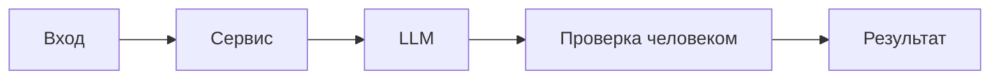

# ADR: решение для первого рабочего сценария

- Статус: proposed
- Дата: 2026-09-14
- Ответственные: команда, документирующая по TRAINING_PR.diff

## Контекст

Существующий API реализует эндпоинт POST `/api/reviews`, принимающий тело `dict` и читающий `payload["diff"]` (app/api.py 35-37). `ReviewService.review(diff: str)` формирует промпт и вызывает `LLM.generate`, возвращая `{ "comment": answer }` (app/review_service.py 19-22). Отсутствует явная валидация входа и обработка ошибок LLM; формат ответа фактически текстовый комментарий.

## Решение

Для первого рабочего сценария закрепить контракт: вход — JSON с обязательным полем `diff: str`; выход — JSON `{ "comment": str }`. Добавить на уровне FastAPI схему запроса для получения 422 при невалидном входе. Обработка ошибок LLM зафиксирована как риск и выносится в последующие инкременты.

## Рассмотренные альтернативы

| Альтернатива | Почему не выбрали сейчас |
|---|---|
| Немедленно добавить сложную обработку ошибок LLM и лимиты размера diff | Не подтверждено TRAINING_PR.diff; усложняет первый инкремент; отсутствуют требования |
| Менять формат ответа на структурированный список | Нет подтверждения в источниках; текущие клиенты ожидают `{ "comment": str }` |

## Последствия и главный риск

- Положительные последствия:
  - Снижение 5xx на невалидных запросах за счёт 422.
  - Предсказуемость ответа `{ "comment": str }`.
- Ограничения:
  - Не покрыты ошибки LLM и ограничения размера diff в этом инкременте.
- Главный риск:
  - Ошибки/таймауты LLM приведут к 5xx без стабильного тела.
- Как проверим риск:
  - Интеграционные сценарии с инъекцией ошибок LLM (документированы в tests_integration.md).

## Архитектурная схема

## Как использовали AI

- Для чего: зафиксировать архитектурное решение первого инкремента на основе TRAINING_PR.diff.
- Тип промпта: master prompt.
- Строка в [`prompts.md`](prompts.md): P1-03.
- Что проверили и исправили сами:
