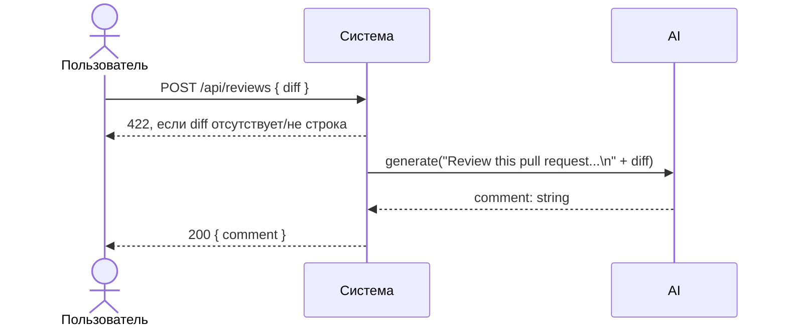

# Use cases и user stories

## Первый рабочий сценарий

**Когда** клиент HTTP API отправляет POST /api/reviews с телом JSON `{"diff": "<строка диффа>"}`, **система** валидирует наличие и тип поля `diff`, передаёт его в ReviewService, который формирует промпт `"Review this pull request and find problems:\n{diff}"` и вызывает `LLM.generate`, **а пользователь получает** ответ JSON `{"comment": "<текст замечаний>"}`.

Не входит в этот сценарий:

- Аутентификация и авторизация.
- Ограничение размера `diff` и токенов.
- Обработка ошибок LLM и маппинг кодов 5xx/502/503.
- Любые изменения контракта ответа, кроме фиксации текущего формата `{"comment": str}` в документации.

## Use case

| Поле | Значение |
|---|---|
| Актор | Клиент HTTP API (разработчик/сервис) |
| Триггер | Вызов POST `/api/reviews` |
| Предусловия | У клиента есть строка `diff` в формате текстового диффа |
| Основной результат | Возвращён JSON `{"comment": str}` с выводом LLM |
| Ошибка или отказ | При отсутствии поля `diff` — 422 (в этом инкременте — за счёт схемы запроса); сбои LLM за пределами сценария |



## User stories и acceptance criteria

```gherkin
Feature: Ревью диффа через POST /api/reviews

  Scenario: Позитивный ответ при валидном diff
    Given FastAPI-приложение запущено и доступен эндпоинт POST /api/reviews
    And тело запроса содержит поле diff как строку
    When я отправляю запрос POST /api/reviews с валидным diff
    Then я получаю статус 200
    And тело ответа имеет JSON с ключом "comment" строкового типа

  Scenario: Негативный — отсутствует поле diff
    Given FastAPI-приложение запущено
    And я отправляю POST /api/reviews без поля diff
    When запрос обрабатывается
    Then я получаю статус 422
    And валидация указывает на отсутствие обязательного поля
```

## Как использовали AI

- Для чего: сформулировать use case, user story и критерии приёмки из подтверждённых фактов TRAINING_PR.diff.
- Тип промпта: master prompt.
- Строка в [`prompts.md`](prompts.md): P1-03.
- Что проверили и исправили сами:
