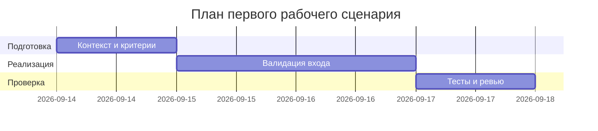

# План поставки

Файл ведёт OpenCode. Обсудите с агентом содержание и проверьте предложенный diff. Все дополнения и исправления поручайте агенту в чате.

## Инкременты и ответственность

| Инкремент | Наблюдаемый результат | Что делает человек | Что делает AI или субагент | Проверка | Зависимости |
|---|---|---|---|---|---|
| 1 | Зафиксирован контракт входа/выхода и сценарий | Уточняет и документирует схему запроса (diff: str) и формат ответа | Помогает сверить формулировки по TRAINING_PR.diff | Ревью документов (analysis/product_management) | TRAINING_PR.diff |
| 2 | Добавлена валидация входа на уровне FastAPI | Реализует Pydantic-модель запроса/response_model | Генерирует шаблон модели и тестов по описанию | Негативные и позитивные тесты проходят | Инкремент 1 |
| 3 | План интеграционных проверок ошибок LLM | Описывает риски и сценарии обработки ошибок | Предлагает варианты маппинга ошибок | Проверка наличия плана и случаев | Инкремент 1 |

## Диаграмма Ганта

Передайте OpenCode даты и задачи своего плана и попросите обновить диаграмму.

## Как использовали AI

- Для чего: собрать минимальный план поставки для первого сценария, не выходя за факты TRAINING_PR.diff.
- Тип промпта: master prompt.
- Строка в [`prompts.md`](prompts.md): P1-03.
- Что проверили и исправили сами:
