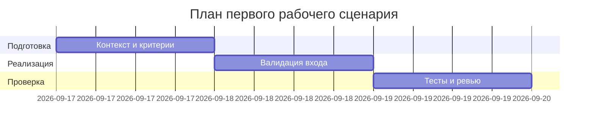

# План поставки

## Инкременты и ответственность

| Инкремент | Наблюдаемый результат | Что делает человек | Что делает AI или субагент | Проверка | Зависимости |
|---|---|---|---|---|---|
| 1 | Зафиксирован контракт входа/выхода и сценарий | Уточняет и документирует схему запроса (diff: str) и формат ответа | Помогает сверить формулировки по TRAINING_PR.diff | Ревью документов (analysis.md, product_management.md) | TRAINING_PR.diff |
| 2 | Добавлена валидация входа на уровне FastAPI | Реализует Pydantic-модель запроса/response_model | Генерирует шаблон модели и тестов по описанию | Негативные и позитивные тесты проходят | Инкремент 1 |
| 3 | План интеграционных проверок ошибок LLM | Описывает риски и сценарии обработки ошибок | Предлагает варианты маппинга ошибок | Проверка наличия плана и случаев | Инкремент 1 |

## Диаграмма Ганта

## Как использовали AI

- Для чего: собрать минимальный план поставки для первого сценария, не выходя за факты TRAINING_PR.diff.
- Тип промпта: master prompt.
- Строка в [`prompts.md`](../../practice_01/prompts.md): P1-03.
- Что проверили и исправили сами: удалили шаблонную подсказку под диаграммой; заполнили подпункт «Что проверили и исправили сами»; исправили ссылку «analysis/product_management» на фактические файлы; согласовали даты и зависимости диаграммы; проверили соответствие требованиям P1-03 и отсутствие внешних фактов.
